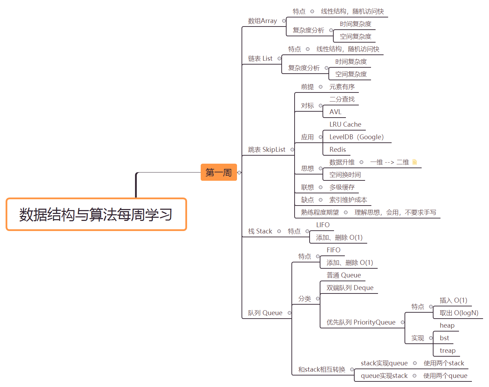

# 算法训练营week01学习笔记

## 算法笔记总结

### 算法思想

- 升维

  升维后信息更加丰富，自然也能降低时间复杂度。典型示例：list --> skipList

- 空间换时间

  **适用场景**：适合对时间复杂度要求高的场合。但像单片机这种由于自身硬件特点，对空间复杂度要求较高，这种思想未必合适。

  **出现背景**：摩尔定律。

  **典型示例**：添加辅助数据结构。比如Hash。

- 最小重复子问题

  迭代、递归。

### 算法笔记

## 关于学习方法的思考总结

### 融合、检验方法（元学习）

方法再多，如果不能消化吸收，终不能为我所用。我们需要的是『北冥神功』，而不是『吸星大法』。

实践是验证方法是否有效的唯一标准。方法是否能够解决问题，是否能够有效解决问题（很多领域需要短平快），只有躬亲实践才能给出答案。

### 职业化训练

>  主要观点来自覃超老师

- 拆解知识点

  这里有一个前提：需要首先了解知识所在领域及领域知识图谱。极客时间很多专栏都会在开篇给出一个课程大纲或技能图谱，包括作者提供的目录索引，都是一份很好的知识地图。在互联网如此发达的情况下，我们当然也可以集百家之长，消化吸收形成自己更加全面的知识地图。

  有了好的知识地图，就不会迷失方向。

- 刻意练习

  k刻意练习是职业化训练的核心。刻意练习包含两层要义：一是宽度，对自己不熟悉的技能加强训练，不出现明显短板；二是深度，对一项技能反复训练，达到一定的熟练程度。

  这两层要义因人而异，因不同人生阶段而异。相对来说，在算法训练阶段，对一道题反复训练（覃超老师称之五毒神掌）尤为重要。

  重复训练是不少优秀之人共同的特质。孔子提倡「温故而知新」。李小龙说过：『我不害怕会一万种腿法的人，但我害怕把一种腿法练上一万次的人。』前段时间读过薇安老师的《迭代：让情商和见识成为你最大的底气》和朱赟老师的书籍《跃迁——从技术到管理的硅谷路径》也都谈到了类似的观点。从算法路径到职业路径，重复、迭代都是提升的一种有效途径。这点上我还有很多待改进的空间，不过很庆幸覃超老师再次帮我深刻认知到了自己在该点上的不足。

  > 关于重复，还要注意防止低水平重复。每次重复一定是一次思维的升华，低水平重复没有意义。

- 反馈

  - 主动
  - 被动
  - 即时

  训练营小组群、作业当然都是对反馈的强化。我觉得由于自己目前在工作上的时间安排，可能未必能做到及时分享，但可以确保的是，一定会有反馈和输出。

### 切题四件套

> 主要观点来自覃超老师

- 审题

  保证能切实明确问题的意思，包括题面的问题和隐性的问题（比如问题背景、限制等）。一种有效的方法是举例子。

- 尽可能多的solution

  思维的广度，全局观。想出尽可能多的solution，才能优中选优。在开发中的技术选型也是典型。

- 实现

  注意边界条件。

  注意学习他人的编程技巧。

- 测试

- 总结

  这点是我自己加的。总结有助于深化认识。

### 五毒神掌

> 和艾宾浩斯记忆曲线有异曲同工之妙。

- 第一遍
  - 5分钟读题、思考
  - 直接看解答，比较优劣
  - 背诵、默写
- 第二遍
  - 自己写，提交LeetCode
  - 多种解法比较、体会
- 第三遍（>=24H）
  - 不同解法熟练
- 第四遍（>=7D）
- 第五遍（面试前两周或一周）

> 切题四件套和五毒神掌的关系
>
> 双循环，外层是五毒神掌，内层是切题四件套。

### 知识屏蔽

> 主要观点来自《汇编语言》作者王爽老师。

- 抓住主线，不要被旁枝末节所扰。譬如工具。
- 学习新知识避免出现用其他新知识解释新知识。知识提供者需要反思是否出现该问题，使用者需要做到两点：一是要识货，会挑选；二是要懂得抓大放小。
